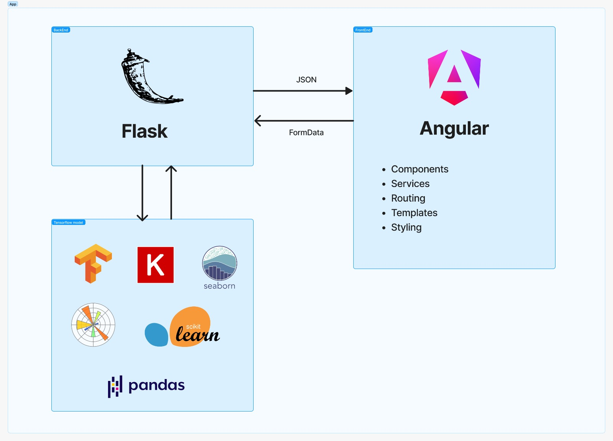

# Brain Tumor Segmentation Project

This project tackles the critical challenge of automatic brain tumor segmentation from MRI images. It combines deep learning and image processing techniques to offer an accurate and efficient tool for tumor diagnosis and monitoring.

### Architecture:

A visual representation of the project architecture is available here: 

  

### Model Evaluation:

| Metric | Accuracy | Precision | Recall | F1-Score |
|--------|----------|-----------|--------|----------|
| Value |  79.8%    |   82.32%  | 77.91% |  77.64%  |

### Project Execution:

**Backend:**

1. Clone the GitHub repository: `git clone https://github.com/NouhaylaMouakkal/Brain-Tumor-Segmentation`
2. Install dependencies: `pip install Flask tensorflow flask_cors tensorflow-addons numpy matplotlib pandas seaborn scikit-learn`
3. Start the API server: `python api.py`

**Frontend:**

1. Clone the frontend's GitHub repository: `git clone https://github.com/AhmedHoussamBouzine/client-ml-project`
2. Install dependencies: `npm install @angular/cli && npm i`
3. Start the web server: `ng serve`

**Notes:**

* The backend utilizes Flask for the API and TensorFlow for segmentation.
* The frontend is an AngularJS application that interacts with the API to display segmentation results.

By contributing to this project, you can play a role in improving brain tumor diagnosis and treatment.

### *BY* : 
### MOUAKKAL Nouhayla II-BDCC2
### BOUZINE Ahmed Houssam II-BDCC2

**License:**
This project is licensed under the MIT License.
